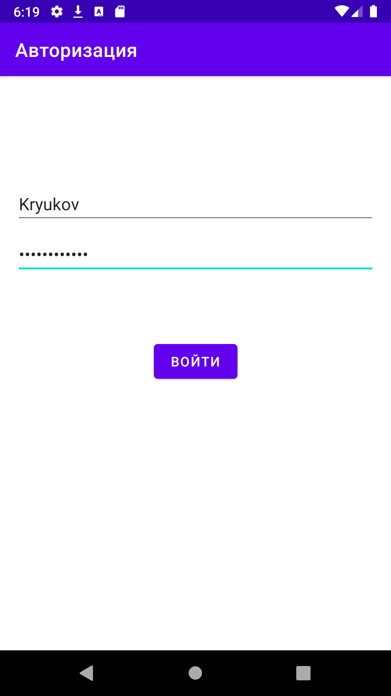
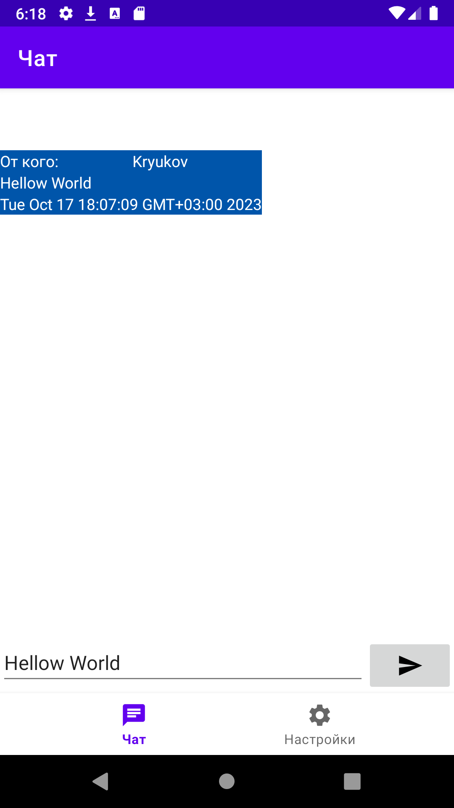
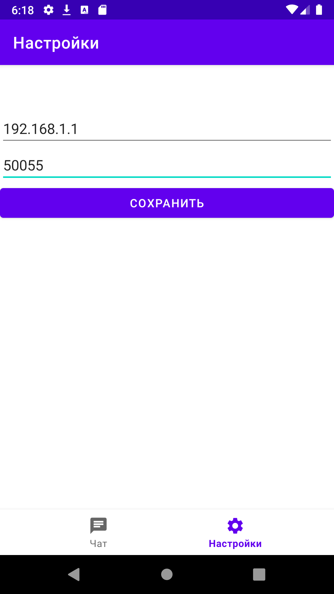
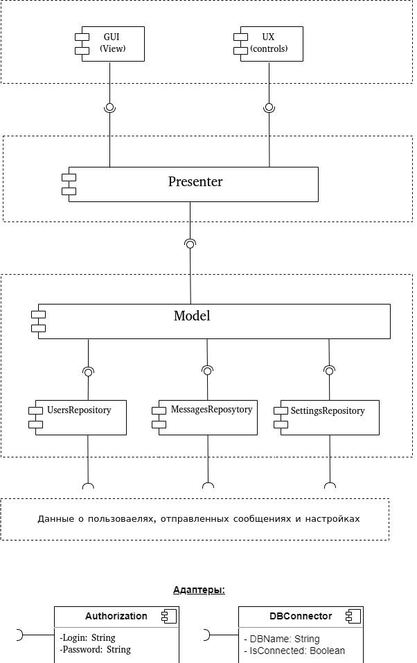
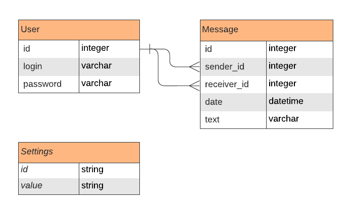

# GeekChat
## Android мессенджер для обмена сообщениями в локальной сети.

В качестве архитектуры для приложения была выбрана MVP, т.к. она представляет собой эффективную архитектурную модель для разработки Android приложений. Основные преимущества паттерна Model-View-Presenter следующие:

- Более простая отладка. Программистам проще делать отладку в приложении, так как MVP использует три разных слоя абстракций. Проводить модульное тестирование также проще, поскольку бизнес-логика полностью отделена от View.
- Разрешает повторное использование кода. При построении MVP архитектуры разработчики могут многократно применять уже написанный код. Это становится возможным благодаря множеству представителей, которые контролируют Views. Такой подход - более надежен по сравнению с использованием только одного presenter.
- Эффективное разделение функциональностей приложения — под ним понимается отделение бизнес-логики и других частей от классов активности и фрагментов, которые, в свою очередь, лучше обеспечивают разделение функциональностей.

С более подробным описанием выбранной архитектуры можно ознакомиться [здесь](https://smartum.pro/ru/blog-ru/mvp-architecture-development-for-android-apps-tips-and-technologies/).

## Внешний вид приложения.

## UML.

## ERD.
