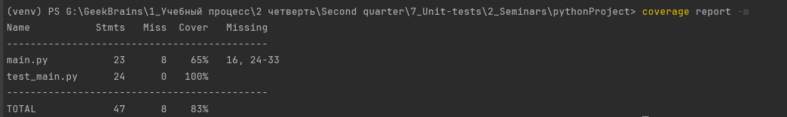
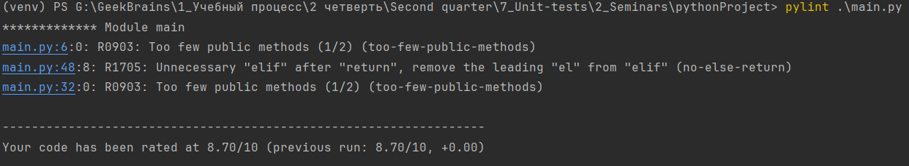
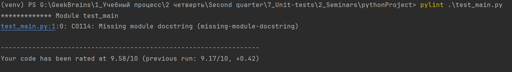

# Домашнее задание по семинару № 6 "Юнит тестирование в других языках"

Тест на покрытие кода `main.py` тестами из `test_main.py` показал 100%.

При использовании инструмента `Pylint` было выявлено, что в `main.py` не хватает аннотаций к модулю, классу и каждому методу, а также некоторые строки были слишком длинные. Не успел все исправить, 8,7 из 10 в итоге. 

Протестировал инструментом `Pylint` также и код самого теста `test_main.py`, были выявлены те же ошибки, исправил. 9,6 из 10 в итоге.

## Тесты, охватывают несколько различных сценариев использования приложения, обеспечивая проверку его функциональности и корректности. 
* test_compare_averages:
В этом тесте проверяем, как программа справляется с двумя непустыми списками разных чисел и сравнивает их средние значения.
Этот сценарий позволяет убедиться, что программа правильно вычисляет средние значения и сравнивает их, возвращая ожидаемый результат.

* test_empty_lists:
В этом тесте мы проверяем, как программа обрабатывает ситуацию, когда один из списков пуст, а другой нет.
Этот сценарий помогает удостовериться, что программа корректно обрабатывает случай, когда один из списков пуст, и продолжает сравнивать непустой список с пустым.

* test_negative_numbers:
Этот тест проверяет, как программа обрабатывает списки с отрицательными числами.
Этот сценарий полезен для проверки того, что программа может корректно обрабатывать и сравнивать списки с отрицательными числами.

